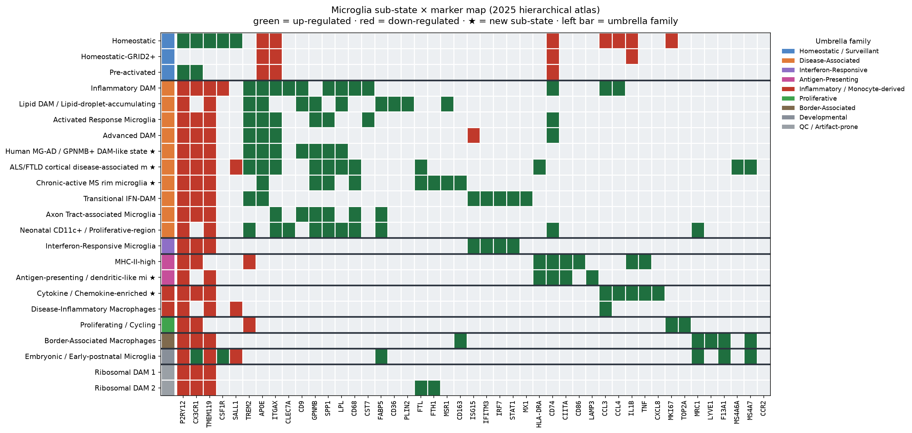
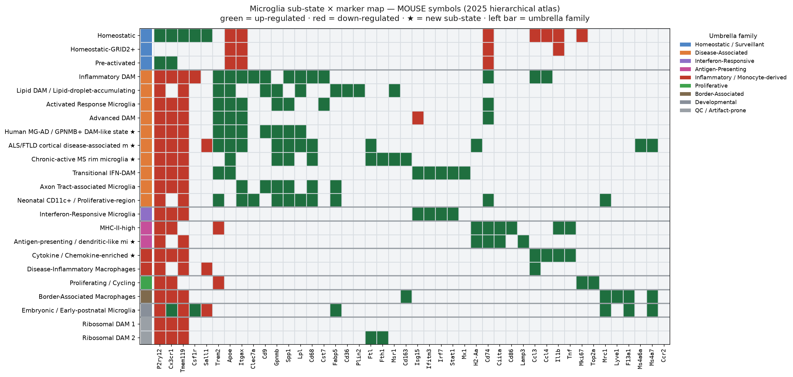

# Microglia Subtype Marker Atlas — Hierarchical (2025)

A refreshed, **hierarchically organized** reference of microglia / CNS-myeloid markers: **9 umbrella families → 23 sub-states**, with **parallel human (HUGO) and mouse (MGI) gene symbols**, up- and down-regulated markers, a curated **protein / surface-marker** column, **denoised** gene sets (dissociation artifacts removed), and references linked directly to their DOI.

> Independent update of the *Comprehensive Characterization of Major Microglia Subtypes* table from [CompCy-lab/microglia-aging-clock](https://github.com/CompCy-lab/microglia-aging-clock). Disease-associated states form a **continuum**, so they are grouped under one umbrella with sub-states beneath rather than listed as independent clusters.

🔎 **Searchable, collapsible site:** [index.html](./index.html)  ·  🧪 **Validation:** [LITERATURE_VALIDATION.md](./LITERATURE_VALIDATION.md)

**★ = newly added sub-state** in this update (not in the original 2024/2025 list). 5 sub-states are new: Human MG-AD/GPNMB+, ALS/FTLD cortical, MS-rim (MIMS-iron), Antigen-presenting/DC-like, and Cytokine/CRM.

> **Species note:** Human symbols are the curated primary set (HGNC-validated). Mouse symbols are computationally mapped from the human set (title-case + a curated exceptions table for MHC, mitochondrial and one-to-many cases); mouse-only homeostatic markers (*Fcrls, Siglech*) with no human ortholog are restored on the mouse side. Orthology is not always 1:1 — a dash (—) means no clean counterpart in that species.

## Marker maps

**Human symbols**

**Mouse symbols**

*Same layout, both species. Sub-states grouped by umbrella family (left color bar). Green = up-regulated, red = down-regulated, ★ = newly added. Markers ordered by functional theme; the human-only CXCL8 has no mouse panel column.*

## Why hierarchical?

Validation against annotated microglia in three ALS datasets showed the disease-associated signatures overlap heavily (max Jaccard 0.42) — they are a trajectory, not discrete types. Scoring per sub-state and rolling up to the umbrella reaches **73% family-level accuracy**. See [`scoring/`](scoring) for a ready-to-use annotation tool and [LITERATURE_VALIDATION.md](LITERATURE_VALIDATION.md) for the full validation.

## The 9 umbrella families

| Umbrella family | Sub-states | Notes |
|---|---|---|
| **Homeostatic / Surveillant** | 3 | Healthy-brain surveillant microglia and early-transition states. Core: P2RY12, CX3CR1, TMEM119, CSF1R. |
| **Disease-Associated (DAM / activation continuum)** | 10 | A continuum of activated/disease-associated states (DAM/MGnD/ARM and human/disease-specific variants). They share TREM2/ |
| **Interferon-Responsive** | 1 | Type-I IFN signature. Define by ISG transcripts (ISG15, IFITM3, IRF7, STAT1); BST2 surface. |
| **Antigen-Presenting (MHC-II / DC-like)** | 2 | MHC class II / antigen presentation. HLA-DR, CD74, CIITA; DC-like fraction adds LAMP3/CCR7. |
| **Inflammatory / Monocyte-derived** | 2 | Cytokine-releasing and monocyte-derived (DIM) cells. DIM is SALL1-neg/CCR2+ (monocyte origin), distinct from microglial  |
| **Proliferative** | 1 | Cell-cycle microglia. Ki-67/TOP2A (intracellular). |
| **Border-Associated (BAM / CAM)** | 1 | CNS-border macrophages (perivascular/meningeal/choroid). CD163/CD206/LYVE1 — NOT parenchymal microglia. |
| **Developmental** | 1 | Embryonic/early-postnatal microglia (developmental context). |
| **QC / Artifact-prone (use with caution)** | 2 | States frequently attributable to ambient RNA or ex-vivo dissociation (ribosomal, immediate-early, heat-shock). Retained |

## Full hierarchical table

Each sub-state lists **human** then **mouse** up/down markers. Protein, context and references follow.

### Homeostatic / Surveillant  (3 sub-states)

*Healthy-brain surveillant microglia and early-transition states. Core: P2RY12, CX3CR1, TMEM119, CSF1R.*

| Sub-state | Human ↑ | Human ↓ | Mouse ↑ | Mouse ↓ | Protein / surface | Context | References |
|---|---|---|---|---|---|---|---|
| Homeostatic | P2RY12, CX3CR1, TMEM119, SALL1, HEXB, CSF1R, TGFBR1, MERTK, ITGB5, SPARC, GPR34, OLFML3, SELPLG, P2RY13, ADGRB1, KBTBD12, RASGEF1C | ITGAX, APOE, CD74, IL1B, CCL3, CCL4, MKI67 | P2ry12, Cx3cr1, Tmem119, Sall1, Hexb, Csf1r, Tgfbr1, Mertk, Itgb5, Sparc, Gpr34, Olfml3, Selplg, P2ry13, Adgrb1, Kbtbd12, Rasgef1c, Fcrls, Siglech | Itgax, Apoe, Cd74, Il1b, Ccl3, Ccl4, Mki67 | P2RY12 (S), TMEM119 (S), CX3CR1 (S), CSF1R/CD115 (S), MERTK (S); SALL1 (I, nuclear TF) | Normal healthy brain; dominant in adult brain | [Hammond et al. 2019](https://doi.org/10.1016/j.immuni.2018.11.004); [Masuda et al. 2019](https://doi.org/10.1038/s41586-019-0924-x); [Galatro et al. 2017](https://doi.org/10.1038/nn.4597); [Paolicelli et al. 2022](https://doi.org/10.1016/j.neuron.2022.10.020) |
| Homeostatic-GRID2+ | GRID2, PRDM11, ADGRB3, SYNDIG1, DSCAM, MED12L, NAV2, RASGEF1C, TBC1D4, USP6NL, MAP4K4, DOCK10, RALGAPA2, TBC1D9, TBC1D12, EVI5, SNX13, RAP1GAP2 | APOE, CD74, ITGAX, IL1B | Grid2, Prdm11, Adgrb3, Syndig1, Dscam, Med12l, Nav2, Rasgef1c, Tbc1d4, Usp6nl, Map4k4, Dock10, Ralgapa2, Tbc1d9, Tbc1d12, Evi5, Snx13, Rap1gap2 | Apoe, Cd74, Itgax, Il1b | P2RY12 (S), TMEM119 (S); GRID2 (S, glutamate receptor) — note: largely a snRNA/ambient signature, validate by IHC | Potential response to tau-bearing neurons; specialized homeostatic function | [Martins-Ferreira et al. 2025](https://doi.org/10.1038/s41467-025-56124-1); [Gerrits et al. 2021](https://doi.org/10.1007/s00401-021-02263-w) |
| Pre-activated | P2RY12, CX3CR1, SERPINE1, PELI2, FOXP2, INPP5D, CARD11, ID2, NCKAP1L, CSF3R, PADI2, PREX1, TRPM2, SWAP70, GAB1, RGS1, CD83 | ITGAX, APOE, CD74 | P2ry12, Cx3cr1, Serpine1, Peli2, Foxp2, Inpp5d, Card11, Id2, Nckap1l, Csf3r, Padi2, Prex1, Trpm2, Swap70, Gab1, Rgs1, Cd83 | Itgax, Apoe, Cd74 | P2RY12 (S), CX3CR1 (S); CD83 (S, early activation) | Transition state between homeostasis and activation; response to subtle perturbations | [Martins-Ferreira et al. 2025](https://doi.org/10.1038/s41467-025-56124-1); [Marsh et al. 2022](https://doi.org/10.1038/s41593-022-01022-8) |

### Disease-Associated (DAM / activation continuum)  (10 sub-states)

*A continuum of activated/disease-associated states (DAM/MGnD/ARM and human/disease-specific variants). They share TREM2/APOE/ITGAX/GPNMB and differ by sub-state-specific markers. NOT discrete clusters — a trajectory.*

| Sub-state | Human ↑ | Human ↓ | Mouse ↑ | Mouse ↓ | Protein / surface | Context | References |
|---|---|---|---|---|---|---|---|
| Inflammatory DAM | APOE, CLEC7A, ITGAX, LGALS3, SPP1, AXL, LPL, CST7, CD74, TYROBP, TREM2, CD9, CSF1, CD63, LAG3, CD68, CCL3, CCL4, TMEM163, HAMP | P2RY12, TMEM119, CX3CR1, HEXB, CSF1R | Apoe, Clec7a, Itgax, Lgals3, Spp1, Axl, Lpl, Cst7, Cd74, Tyrobp, Trem2, Cd9, Csf1, Cd63, Lag3, Cd68, Ccl3, Ccl4, Tmem163, Hamp, Fcrls | P2ry12, Tmem119, Cx3cr1, Hexb, Csf1r | TREM2 (S), CD9 (S), ITGAX/CD11c (S), CLEC7A/Dectin-1 (S), CD63 (S/lysosomal), CD68 (I, lysosomal), GPNMB (S); SPP1/osteopontin (secreted) | Alzheimer's disease, amyloid pathology, neurodegeneration, aging | [Keren-Shaul et al. 2017](https://doi.org/10.1016/j.cell.2017.05.018); [Krasemann et al. 2017](https://doi.org/10.1016/j.immuni.2017.08.008); [Hammond et al. 2019](https://doi.org/10.1016/j.immuni.2018.11.004); [Martins-Ferreira et al. 2025](https://doi.org/10.1038/s41467-025-56124-1); [Sun et al. 2023](https://doi.org/10.1016/j.cell.2023.08.037) |
| Lipid DAM / Lipid-droplet-accumulating microglia | GPNMB, LGALS3, FABP5, LGALS1, LILRB4, CCL15, ANXA5, PLD3, CD9, CD36, LPL, APOE, TREM2, FABP4, NPC1, NPC2, MSR1, PLIN2, APOC1, PPARG, MITF | P2RY12, TMEM119 | Gpnmb, Lgals3, Fabp5, Lgals1, Lilrb4a, Ccl15, Anxa5, Pld3, Cd9, Cd36, Lpl, Apoe, Trem2, Fabp4, Npc1, Npc2, Msr1, Plin2, Apoc1, Pparg, Mitf | P2ry12, Tmem119 | GPNMB (S), CD9 (S), CD36 (S, scavenger), TREM2 (S), MSR1/CD204 (S); lipid droplets by BODIPY/PLIN2 (I) | Phagocytosis of myelin/lipid debris; expanded in aging, demyelination and AD; LDAM are a dysfunctional aging state | [Marschallinger et al. 2020](https://doi.org/10.1038/s41593-019-0566-1); [Hammond et al. 2019](https://doi.org/10.1016/j.immuni.2018.11.004); [Martins-Ferreira et al. 2025](https://doi.org/10.1038/s41467-025-56124-1) |
| Activated Response Microglia (ARM) | HLA-DRB1, HLA-DRB5, CD74, DKK2, GPNMB, SPP1, APOE, TREM2, TYROBP, ITGAX, LGALS3, CST7, CTSS | P2RY12, TMEM119, CX3CR1 | H2-Ab1, H2-Eb1, Cd74, Dkk2, Gpnmb, Spp1, Apoe, Trem2, Tyrobp, Itgax, Lgals3, Cst7, Ctss | P2ry12, Tmem119, Cx3cr1 | TREM2 (S), ITGAX/CD11c (S), GPNMB (S), CD9 (S), HLA-DR/CD74 (S/MHC-II) | Activated in early stages of neurodegeneration; associated with AD risk genes | [Sala Frigerio et al. 2019](https://doi.org/10.1016/j.celrep.2019.03.099); [Sierksma et al. 2020](https://doi.org/10.15252/emmm.201910606) |
| Advanced DAM (S100+) | HLA-DRB1, HLA-DRB5, CD74, S100A6, S100A8, S100A9, CCL15, LGALS3, CD63, ITGAX, CYBB, TREM2, APOE, TYROBP | P2RY12, TMEM119, CX3CR1, ISG15, IFI44L | H2-Ab1, H2-Eb1, Cd74, S100a6, S100a8, S100a9, Ccl15, Lgals3, Cd63, Itgax, Cybb, Trem2, Apoe, Tyrobp | P2ry12, Tmem119, Cx3cr1, Isg15, Ifi44l | TREM2 (S), ITGAX/CD11c (S), CD63 (S); S100A8/A9 alarmins (I/secreted), HLA-DR (S) | Advanced neurodegeneration; Late stage AD, chronic inflammation | [Mathys et al. 2017](https://doi.org/10.1016/j.celrep.2017.09.039) |
| Human MG-AD / GPNMB+ DAM-like state ★ | GPNMB, APOC1, APOE, TREM2, CD9, ITGAX, SPP1, MYO1E, PPARG, NUPR1, CTSB, CTSD, GRN, ASAH1, LPL, CD63 | P2RY12, CX3CR1, TMEM119 | Gpnmb, Apoc1, Apoe, Trem2, Cd9, Itgax, Spp1, Myo1e, Pparg, Nupr1, Ctsb, Ctsd, Grn, Asah1, Lpl, Cd63 | P2ry12, Cx3cr1, Tmem119 | GPNMB (S), TREM2 (S), CD9 (S), ITGAX/CD11c (S), CD68 (I) | Human Alzheimer's disease cortex; lipid/cholesterol handling; defines the disease end of the human activation trajectory | [Sun et al. 2023](https://doi.org/10.1016/j.cell.2023.08.037); [Prater et al. 2023](https://doi.org/10.1038/s43587-023-00424-y); [Green et al. 2024](https://doi.org/10.1038/s41586-024-07871-6); [Martins-Ferreira et al. 2025](https://doi.org/10.1038/s41467-025-56124-1) |
| ALS/FTLD cortical disease-associated microglia ★ | CD68, SPP1, APOC1, APOE, FTL, GPNMB, LPL, CD63, MS4A6A, MS4A7, CD83, HLA-DRA, ITGAX, TREM2 | P2RY12, CX3CR1, TMEM119, SALL1 | Cd68, Spp1, Apoc1, Apoe, Ftl, Gpnmb, Lpl, Cd63, Ms4a6a, Ms4a7, Cd83, H2-Aa, Itgax, Trem2 | P2ry12, Cx3cr1, Tmem119, Sall1 | CD68 (I), HLA-DR (S), TREM2 (S), GPNMB (S), MS4A6A/MS4A7 (S) | ALS and FTLD motor & prefrontal cortex; reactive/phagocytic microglia expanded with TDP-43 pathology and C9orf72 status | [Pineda et al. 2024](https://doi.org/10.1016/j.cell.2024.02.031) |
| Chronic-active MS rim microglia (MIMS-iron) ★ | FTL, FTH1, CD163, APOC1, APOE, GPNMB, MSR1, SPP1, CD68, ACSL1, NAMPT, SLC11A1 | P2RY12, TMEM119, CX3CR1 | Ftl, Fth1, Cd163, Apoc1, Apoe, Gpnmb, Msr1, Spp1, Cd68, Acsl1, Nampt, Slc11a1 | P2ry12, Tmem119, Cx3cr1 | FTL/ferritin (I, by IHC), CD163 (S), MSR1/CD204 (S), CD68 (I); paramagnetic iron rim on 7T MRI | Rim of chronic-active (smoldering) MS lesions; iron accumulation; drives lesion expansion and disability | [Absinta et al. 2021](https://doi.org/10.1038/s41586-021-03892-7) |
| Transitional IFN-DAM | ISG15, IFI44L, IRF9, IFITM3, IRF7, ZBP1, CXCL10, STAT1, MX1, OASL, ISG20, IFIT1, IFIT2, IFIT3, APOE, TREM2 | P2RY12, TMEM119, CX3CR1 | Isg15, Ifi44l, Irf9, Ifitm3, Irf7, Zbp1, Cxcl10, Stat1, Mx1, Oasl1, Oasl2, Isg20, Ifit1, Ifit2, Ifit3, Apoe, Trem2 | P2ry12, Tmem119, Cx3cr1 | TREM2 (S) + BST2 (S); transitional — defined transcriptionally (ISG + DAM) | Early phase of disease-associated transformation; transition state | [Mathys et al. 2017](https://doi.org/10.1016/j.celrep.2017.09.039); [Sun et al. 2023](https://doi.org/10.1016/j.cell.2023.08.037) |
| Axon Tract-associated Microglia (ATM) / White-matter-associated (WAM) | ITGAX, IGF1, SPP1, GPNMB, LGALS3, CD68, CD9, FABP5, PLD3, CTSL, LGALS1, LILRB4, CD63, CTSB | P2RY12, TMEM119, CX3CR1 | Itgax, Igf1, Spp1, Gpnmb, Lgals3, Cd68, Cd9, Fabp5, Pld3, Ctsl, Lgals1, Lilrb4a, Cd63, Ctsb | P2ry12, Tmem119, Cx3cr1 | CLEC7A (S), ITGAX/CD11c (S), CD9 (S), GPNMB (S), CD68 (I); TREM2-dependent | Developmental white matter (corpus callosum); aging white matter (WAM). TREM2-dependent, clear myelin debris | [Hammond et al. 2019](https://doi.org/10.1016/j.immuni.2018.11.004); [Safaiyan et al. 2021](https://doi.org/10.1016/j.neuron.2021.01.027) |
| Neonatal CD11c+ / Proliferative-region-associated (PAM) | ITGAX, IGF1, SPP1, GPNMB, CLEC7A, TREM2, LGALS3, CD68, FABP5, LPL, CSF1, MRC1, CD74 | P2RY12, TMEM119 | Itgax, Igf1, Spp1, Gpnmb, Clec7a, Trem2, Lgals3, Cd68, Fabp5, Lpl, Csf1, Mrc1, Cd74 | P2ry12, Tmem119 | ITGAX/CD11c (S), CLEC7A (S), CD9 (S), TREM2 (S), GPNMB (S), SPP1 (secreted) | Early postnatal development (P1-P8); synaptic pruning, brain wiring | [Wlodarczyk et al. 2017](https://doi.org/10.15252/embj.201696056); [Benmamar-Badel et al. 2020](https://doi.org/10.3389/fimmu.2020.00430) |

### Interferon-Responsive  (1 sub-state)

*Type-I IFN signature. Define by ISG transcripts (ISG15, IFITM3, IRF7, STAT1); BST2 surface.*

| Sub-state | Human ↑ | Human ↓ | Mouse ↑ | Mouse ↓ | Protein / surface | Context | References |
|---|---|---|---|---|---|---|---|
| Interferon-Responsive Microglia (IRM) | IFI27, IFITM3, CCL2, BST2, IFIT3, ISG15, IFI16, IRF7, CXCL10, OASL, RTP4, B2M, STAT1, IRF9, IFIH1, IFIT1, IRF1, IRF8, ZBP1, CH25H | P2RY12, TMEM119, CX3CR1 | Ifi27, Ifitm3, Ccl2, Bst2, Ifit3, Isg15, Ifi16, Irf7, Cxcl10, Oasl1, Oasl2, Rtp4, B2m, Stat1, Irf9, Ifih1, Ifit1, Irf1, Irf8, Zbp1, Ch25h | P2ry12, Tmem119, Cx3cr1 | BST2/CD317 (S), ISG15 (I, secreted); MHC-I/HLA-A,B,C (S) often up. No unique surface epitope — define by ISG transcripts | Viral infections, sterile inflammation, neurodegeneration with type-I IFN | [Hammond et al. 2019](https://doi.org/10.1016/j.immuni.2018.11.004); [Martins-Ferreira et al. 2025](https://doi.org/10.1038/s41467-025-56124-1); [Sun et al. 2023](https://doi.org/10.1016/j.cell.2023.08.037) |

### Antigen-Presenting (MHC-II / DC-like)  (2 sub-states)

*MHC class II / antigen presentation. HLA-DR, CD74, CIITA; DC-like fraction adds LAMP3/CCR7.*

| Sub-state | Human ↑ | Human ↓ | Mouse ↑ | Mouse ↓ | Protein / surface | Context | References |
|---|---|---|---|---|---|---|---|
| MHC-II-high | HLA-DRB1, HLA-DRB5, CD74, CIITA, HLA-A, B2M, CD86, IL1B, TNF, HLA-DRA, CD40, NLRC5, TAP1, TAP2, PSMB8, PSMB9 | P2RY12, TREM2, CX3CR1 | H2-Ab1, H2-Eb1, Cd74, Ciita, H2-K1, B2m, Cd86, Il1b, Tnf, H2-Aa, Cd40, Nlrc5, Tap1, Tap2, Psmb8, Psmb9 | P2ry12, Trem2, Cx3cr1 | HLA-DR (S, via HLA-DRA/DRB), CD74 (S/I), CD86 (S), CD40 (S) | Antigen presentation; increased in EAE, MS models, and aging | [Mathys et al. 2017](https://doi.org/10.1016/j.celrep.2017.09.039); [Mrdjen et al. 2018](https://doi.org/10.1016/j.immuni.2018.01.011); [Martins-Ferreira et al. 2025](https://doi.org/10.1038/s41467-025-56124-1) |
| Antigen-presenting / dendritic-like microglia (HLA-high II) ★ | HLA-DRA, HLA-DRB1, HLA-DPA1, CD74, CIITA, HLA-DQA1, CD83, LAMP3, CCR7, FLT3, ZBTB46 | P2RY12, TMEM119 | H2-Aa, H2-Ab1, H2-Ea, Cd74, Ciita, Cd83, Lamp3, Ccr7, Flt3, Zbtb46 | P2ry12, Tmem119 | HLA-DR (S), CD74 (S), CD86 (S); LAMP3/DC-LAMP (I) and CCR7 (S) in the cDC-like fraction | Antigen presentation in MS, AD, aging; overlaps MHC-II-high but extends to a dendritic-cell-like CNS-myeloid program | [Martins-Ferreira et al. 2025](https://doi.org/10.1038/s41467-025-56124-1); [Mrdjen et al. 2018](https://doi.org/10.1016/j.immuni.2018.01.011) |

### Inflammatory / Monocyte-derived  (2 sub-states)

*Cytokine-releasing and monocyte-derived (DIM) cells. DIM is SALL1-neg/CCR2+ (monocyte origin), distinct from microglial DAM.*

| Sub-state | Human ↑ | Human ↓ | Mouse ↑ | Mouse ↓ | Protein / surface | Context | References |
|---|---|---|---|---|---|---|---|
| Cytokine / Chemokine-enriched (CRM) ★ | CCL2, CCL3, CCL4, CXCL8, IL1B, TNF, NFKBIA, NFKB1, CCL3L1, CCL4L2 | P2RY12, CX3CR1, TMEM119 | Ccl2, Ccl3, Ccl4, Il1b, Tnf, Nfkbia, Nfkb1 | P2ry12, Cx3cr1, Tmem119 | No unique surface marker; CD83 (S) and CD14 (S) often up; define by cytokine secretion (IL-1β, TNF by intracellular flow/ELISA) | Acute/chronic inflammation across AD, MS, ALS; NF-κB–driven cytokine program; partly overlaps DIM | [Sun et al. 2023](https://doi.org/10.1016/j.cell.2023.08.037); [Martins-Ferreira et al. 2025](https://doi.org/10.1038/s41467-025-56124-1); [Absinta et al. 2021](https://doi.org/10.1038/s41586-021-03892-7) |
| Disease-Inflammatory Macrophages (DIMs) | SLC2A3, CD83, CCL3, CH25H, NAMPT, SRGN, IRAK2, HIF1A, RGS1, MCL1 | P2RY12, TMEM119, SALL1 | Slc2a3, Cd83, Ccl3, Ch25h, Nampt, Srgn, Irak2, Hif1a, Rgs1, Mcl1 | P2ry12, Tmem119, Sall1 | CD44 (S), CD83 (S), CCR2 (S, monocyte origin); SALL1-negative (distinguishes from yolk-sac microglia) | BBB disruption, traumatic injury, experimental autoimmune encephalomyelitis | [Silvin et al. 2022](https://doi.org/10.1016/j.immuni.2022.07.004); [Martins-Ferreira et al. 2025](https://doi.org/10.1038/s41467-025-56124-1) |

### Proliferative  (1 sub-state)

*Cell-cycle microglia. Ki-67/TOP2A (intracellular).*

| Sub-state | Human ↑ | Human ↓ | Mouse ↑ | Mouse ↓ | Protein / surface | Context | References |
|---|---|---|---|---|---|---|---|
| Proliferating / Cycling | MKI67, TOP2A, CENPE, MCM5, BIRC5, CDK1, CCNB2, PCNA, AURKB, CENPF, PLK1, CDCA8, CDCA3, CDC20, CCNA2, CCNB1 | P2RY12, TREM2, CX3CR1 | Mki67, Top2a, Cenpe, Mcm5, Birc5, Cdk1, Ccnb2, Pcna, Aurkb, Cenpf, Plk1, Cdca8, Cdca3, Cdc20, Ccna2, Ccnb1 | P2ry12, Trem2, Cx3cr1 | MKI67 (I, Ki-67 by IHC/flow), TOP2A (I); no unique surface marker — identify by cell-cycle proteins | Injury response, development, repopulation after depletion | [Hammond et al. 2019](https://doi.org/10.1016/j.immuni.2018.11.004); [Martins-Ferreira et al. 2025](https://doi.org/10.1038/s41467-025-56124-1) |

### Border-Associated (BAM / CAM)  (1 sub-state)

*CNS-border macrophages (perivascular/meningeal/choroid). CD163/CD206/LYVE1 — NOT parenchymal microglia.*

| Sub-state | Human ↑ | Human ↓ | Mouse ↑ | Mouse ↓ | Protein / surface | Context | References |
|---|---|---|---|---|---|---|---|
| Border-Associated Macrophages (BAMs) | F13A1, CD163, MRC1, MS4A7, LYVE1, FOLR2, STAB1, PF4, CBR1, CD209, CD163L1, CLEC10A | P2RY12, CX3CR1, TMEM119 | F13a1, Cd163, Mrc1, Ms4a7, Lyve1, Folr2, Stab1, Pf4, Cbr1, Cd209a, Cd163l1, Clec10a | P2ry12, Cx3cr1, Tmem119 | CD163 (S), MRC1/CD206 (S), LYVE1 (S), CD209 (S), F13A1, FOLR2 (S) | Meninges, choroid plexus, perivascular spaces; CNS-immune interface | [Mrdjen et al. 2018](https://doi.org/10.1016/j.immuni.2018.01.011); [Utz et al. 2020](https://doi.org/10.1016/j.cell.2020.03.021) |

### Developmental  (1 sub-state)

*Embryonic/early-postnatal microglia (developmental context).*

| Sub-state | Human ↑ | Human ↓ | Mouse ↑ | Mouse ↓ | Protein / surface | Context | References |
|---|---|---|---|---|---|---|---|
| Embryonic / Early-postnatal Microglia | SPI1, CX3CR1, FABP5, MCM5, CCND1, DAB2, MRC1, MS4A7, FN1, CSF1R, CD4, RUNX1, F13A1 | P2RY12, TMEM119, SALL1 | Spi1, Cx3cr1, Fabp5, Mcm5, Ccnd1, Dab2, Mrc1, Ms4a7, Fn1, Csf1r, Cd4, Runx1, F13a1 | P2ry12, Tmem119, Sall1 | CX3CR1 (S), CSF1R (S), MRC1/CD206 (S, early); SPI1/PU.1 (I, nuclear TF) | Embryonic and early postnatal brain development (E14.5-P4) | [Hammond et al. 2019](https://doi.org/10.1016/j.immuni.2018.11.004) |

### QC / Artifact-prone (use with caution)  (2 sub-states)

*States frequently attributable to ambient RNA or ex-vivo dissociation (ribosomal, immediate-early, heat-shock). Retained so users RECOGNIZE and EXCLUDE them — not recommended as biological annotations.*

| Sub-state | Human ↑ | Human ↓ | Mouse ↑ | Mouse ↓ | Protein / surface | Context | References |
|---|---|---|---|---|---|---|---|
| Ribosomal DAM 1 | SYT1, PCDH9, LSAMP, CADM2, CALM1, KCNIP4, PEBP1, RBFOX1, CNTNAP2, RPL39, DYNLL1, COXFA4, MT-ATP6, RPS27, DLG2, RTN3, MT-ND1, ATP5F1E, RPL18A, RPS18 | P2RY12, TMEM119, CX3CR1 | Syt1, Pcdh9, Lsamp, Cadm2, Calm1, Kcnip4, Pebp1, Rbfox1, Cntnap2, Rpl39, Dynll1, Ndufa4, mt-Atp6, Rps27, Dlg2, Rtn3, mt-Nd1, Atp5f1e, Rpl18a, Rps18 | P2ry12, Tmem119, Cx3cr1 | No specific validated surface marker (signature dominated by ribosomal/mito + neuronal ambient genes; likely low-quality/ambient cluster) | Associated with increased translational activity; found in neurodegenerative contexts | [Martins-Ferreira et al. 2025](https://doi.org/10.1038/s41467-025-56124-1); [Sun et al. 2023](https://doi.org/10.1016/j.cell.2023.08.037); [Marsh et al. 2022](https://doi.org/10.1038/s41593-022-01022-8) |
| Ribosomal DAM 2 | PLEKHA7, MECOM, OOEP, ATP5F1E, FTH1, BAIAP2L1, PLEKHA6, BDNF-AS, FTL, NACA, SLC27A4, APOO, SLC47A1, ZNF90, TXNRD1, XPO5, RPL19, TMSB10, UBA52, TOMM7 | P2RY12, TMEM119, CX3CR1 | Plekha7, Mecom, Ooep, Atp5f1e, Fth1, Baiap2l1, Plekha6, Ftl, Naca, Slc27a4, Apoo, Slc47a1, Txnrd1, Xpo5, Rpl19, Tmsb10, Uba52, Tomm7 | P2ry12, Tmem119, Cx3cr1 | No specific validated surface marker (ferritin FTL/FTH1-high; iron handling); validate by ferritin IHC if used | Similar to Ribo.DAM1 but with distinct ribosomal gene expression pattern | [Martins-Ferreira et al. 2025](https://doi.org/10.1038/s41467-025-56124-1); [Sun et al. 2023](https://doi.org/10.1016/j.cell.2023.08.037); [Marsh et al. 2022](https://doi.org/10.1038/s41593-022-01022-8) |

## Denoising — dissociation artifacts

Immediate-early (FOS, JUN, EGR1…) and heat-shock (HSPA1A/B, DNAJB1…) genes are removed from the `_denoised` gene sets because they are induced artifactually during tissue dissociation — first characterized by [van den Brink et al. 2017](https://doi.org/10.1038/nmeth.4437) and shown to confound microglial state calls by [Marsh et al. 2022](https://doi.org/10.1038/s41593-022-01022-8). A 'Stress / heat-shock' cluster composed *entirely* of these genes was identified during curation and **excluded** as a likely technical artifact. Full blocklist: [`data/microglia_signatures_denoised.json`](data/microglia_signatures_denoised.json).

## Files

- [`index.html`](index.html) — collapsible, searchable site (human + mouse columns)
- [`LITERATURE_VALIDATION.md`](LITERATURE_VALIDATION.md) — marker & designation validation vs human atlases
- [`data/microglia_subtypes_hierarchical.csv`](data/microglia_subtypes_hierarchical.csv) / `.json` — hierarchical table (human + mouse)
- [`data/microglia_signatures_denoised.json`](data/microglia_signatures_denoised.json) — denoised signatures + blocklist
- [`data/microglia_subtypes_updated.csv`](data/microglia_subtypes_updated.csv) — flat table
- [`scoring/`](scoring) — `microglia_scorer.py` auto-annotation tool + usage
- [`assets/marker_map.png`](assets/marker_map.png) — sub-state × marker map

## Caveats & citation

Validated as a **reference**, not a discrete classifier. Marker calls — especially the protein column and the species ortholog conversions — are literature-informed / computational curation; cite the primary DOIs in the table and the [original repository](https://github.com/CompCy-lab/microglia-aging-clock). Code: MIT (`LICENSE`).
